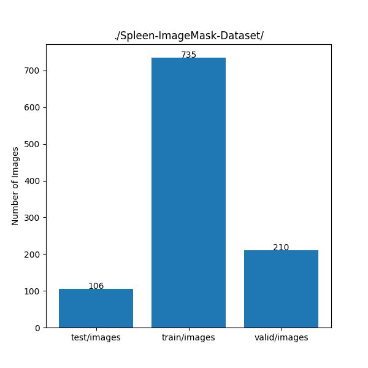
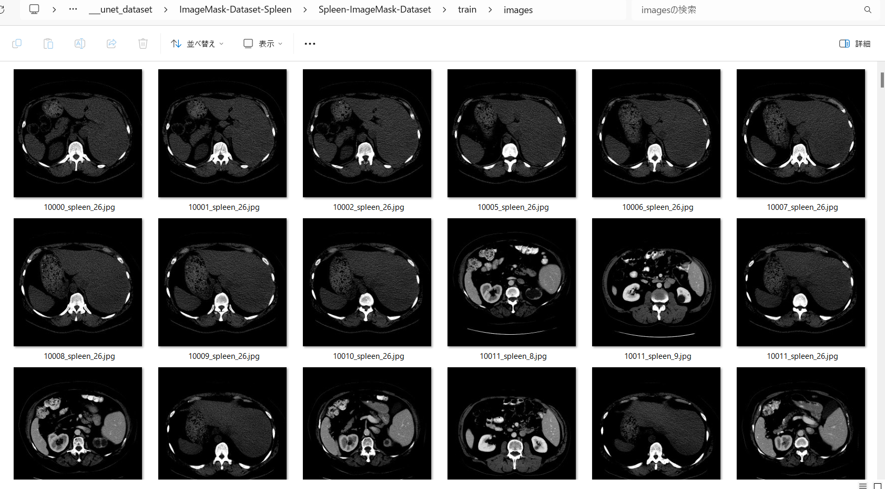
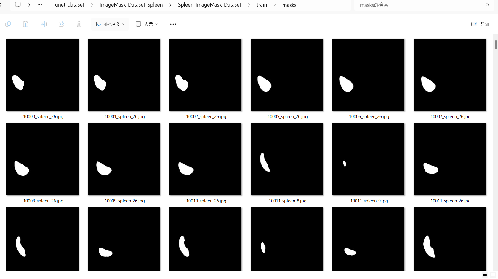

<h2>ImageMask-Dataset-Spleen (2024/03/16)</h2>
This is a Spleen ImageMask Dataset for Image Segmentation.   
 

 

<h3>1. Dataset Citatioin</h3>

The image dataset used here has been taken from the google drive. 
<a href="https://drive.google.com/file/d/1jzeNU1EKnK81PyTsrx0ujfNl-t0Jo8uE/view?usp=drive_link">Task09_Spleen.tar</a>
uploaded by 
<a href="http://medicaldecathlon.com/">Medical Segmentation Decathlon</a>
 
 
<b>About Dataset</b>
<pre>
{ 
"name": "Spleen", 
"description": "Spleen Segmentation",
"reference": "Memorial Sloan Kettering Cancer Center",
"licence":"CC-BY-SA 4.0",
"release":"1.0 06/08/2018",
"tensorImageSize": "3D",
"modality": { 
   "0": "CT"
 }, 
 "labels": { 
   "0": "background", 
   "1": "spleen"
 }, 
 "numTraining": 41, 
 "numTest": 20,
 "training":[{"image":"./imagesTr/spleen_19.nii.gz","label":"./labelsTr/spleen_19.nii.gz"},{"image":"./imagesTr/spleen_31.nii.gz","label":"./labelsTr/spleen_31.nii.gz"},{"image":"./imagesTr/spleen_52.nii.gz","label":"./labelsTr/spleen_52.nii.gz"},{"image":"./imagesTr/spleen_40.nii.gz","label":"./labelsTr/spleen_40.nii.gz"},{"image":"./imagesTr/spleen_3.nii.gz","label":"./labelsTr/spleen_3.nii.gz"},{"image":"./imagesTr/spleen_17.nii.gz","label":"./labelsTr/spleen_17.nii.gz"},{"image":"./imagesTr/spleen_21.nii.gz","label":"./labelsTr/spleen_21.nii.gz"},{"image":"./imagesTr/spleen_33.nii.gz","label":"./labelsTr/spleen_33.nii.gz"},{"image":"./imagesTr/spleen_9.nii.gz","label":"./labelsTr/spleen_9.nii.gz"},{"image":"./imagesTr/spleen_29.nii.gz","label":"./labelsTr/spleen_29.nii.gz"},{"image":"./imagesTr/spleen_46.nii.gz","label":"./labelsTr/spleen_46.nii.gz"},{"image":"./imagesTr/spleen_25.nii.gz","label":"./labelsTr/spleen_25.nii.gz"},{"image":"./imagesTr/spleen_13.nii.gz","label":"./labelsTr/spleen_13.nii.gz"},{"image":"./imagesTr/spleen_62.nii.gz","label":"./labelsTr/spleen_62.nii.gz"},{"image":"./imagesTr/spleen_27.nii.gz","label":"./labelsTr/spleen_27.nii.gz"},{"image":"./imagesTr/spleen_44.nii.gz","label":"./labelsTr/spleen_44.nii.gz"},{"image":"./imagesTr/spleen_56.nii.gz","label":"./labelsTr/spleen_56.nii.gz"},{"image":"./imagesTr/spleen_60.nii.gz","label":"./labelsTr/spleen_60.nii.gz"},{"image":"./imagesTr/spleen_2.nii.gz","label":"./labelsTr/spleen_2.nii.gz"},{"image":"./imagesTr/spleen_53.nii.gz","label":"./labelsTr/spleen_53.nii.gz"},{"image":"./imagesTr/spleen_41.nii.gz","label":"./labelsTr/spleen_41.nii.gz"},{"image":"./imagesTr/spleen_22.nii.gz","label":"./labelsTr/spleen_22.nii.gz"},{"image":"./imagesTr/spleen_14.nii.gz","label":"./labelsTr/spleen_14.nii.gz"},{"image":"./imagesTr/spleen_18.nii.gz","label":"./labelsTr/spleen_18.nii.gz"},{"image":"./imagesTr/spleen_20.nii.gz","label":"./labelsTr/spleen_20.nii.gz"},{"image":"./imagesTr/spleen_32.nii.gz","label":"./labelsTr/spleen_32.nii.gz"},{"image":"./imagesTr/spleen_16.nii.gz","label":"./labelsTr/spleen_16.nii.gz"},{"image":"./imagesTr/spleen_12.nii.gz","label":"./labelsTr/spleen_12.nii.gz"},{"image":"./imagesTr/spleen_63.nii.gz","label":"./labelsTr/spleen_63.nii.gz"},{"image":"./imagesTr/spleen_28.nii.gz","label":"./labelsTr/spleen_28.nii.gz"},{"image":"./imagesTr/spleen_24.nii.gz","label":"./labelsTr/spleen_24.nii.gz"},{"image":"./imagesTr/spleen_59.nii.gz","label":"./labelsTr/spleen_59.nii.gz"},{"image":"./imagesTr/spleen_47.nii.gz","label":"./labelsTr/spleen_47.nii.gz"},{"image":"./imagesTr/spleen_8.nii.gz","label":"./labelsTr/spleen_8.nii.gz"},{"image":"./imagesTr/spleen_6.nii.gz","label":"./labelsTr/spleen_6.nii.gz"},{"image":"./imagesTr/spleen_61.nii.gz","label":"./labelsTr/spleen_61.nii.gz"},{"image":"./imagesTr/spleen_10.nii.gz","label":"./labelsTr/spleen_10.nii.gz"},{"image":"./imagesTr/spleen_38.nii.gz","label":"./labelsTr/spleen_38.nii.gz"},{"image":"./imagesTr/spleen_45.nii.gz","label":"./labelsTr/spleen_45.nii.gz"},{"image":"./imagesTr/spleen_26.nii.gz","label":"./labelsTr/spleen_26.nii.gz"},{"image":"./imagesTr/spleen_49.nii.gz","label":"./labelsTr/spleen_49.nii.gz"}],
 "test":["./imagesTs/spleen_15.nii.gz","./imagesTs/spleen_23.nii.gz","./imagesTs/spleen_1.nii.gz","./imagesTs/spleen_42.nii.gz","./imagesTs/spleen_50.nii.gz","./imagesTs/spleen_54.nii.gz","./imagesTs/spleen_37.nii.gz","./imagesTs/spleen_58.nii.gz","./imagesTs/spleen_39.nii.gz","./imagesTs/spleen_48.nii.gz","./imagesTs/spleen_35.nii.gz","./imagesTs/spleen_11.nii.gz","./imagesTs/spleen_7.nii.gz","./imagesTs/spleen_30.nii.gz","./imagesTs/spleen_43.nii.gz","./imagesTs/spleen_51.nii.gz","./imagesTs/spleen_36.nii.gz","./imagesTs/spleen_55.nii.gz","./imagesTs/spleen_57.nii.gz","./imagesTs/spleen_34.nii.gz"]
 }

</pre>
<h3>
2. Download master dataset
</h3>
Please download the master dataset from the following link 
<a href="https://drive.google.com/file/d/1jzeNU1EKnK81PyTsrx0ujfNl-t0Jo8uE/view?usp=drive_link">Task09_Spleen.tar</a>

The dataset has the following folder structure. 
<pre>
./
├─imagesTr
├─imagesTs
└─labelsTr
</pre>
The <b>imagesTr</b> folder contains spleen*.nii.gz, and <b>labelsTr</b> spleen*.nii.gz file for training.The <b>imagesTs</b> contains 
spleen* nii.gz files for testing.  

Please note that we use <b>imagesTr</b> and <b>labelsTr</b> folders only, because <b>imagesTs</b> has no correspoingn labels (mask) to <b>imagesTs</b>. 
<h3>
3. Create ImageMask Dataset
</h3>
<h3>
3.1 Create master dataset
</h3>
Please run Python script <a href="./generator/ImageMaskDatasetGenerator.py">ImageMaskDatasetGenerator.py</a>.
to create jpg image and mask files. 
<pre>
>python ImageMaskDatasetGenerator.py
</pre>
This script performs the following image processings. 
<pre>
1 Create 512x512 square masks from the spleen*.nii.gz files in labelsTr.
2 Create 512x512 square images corresponding to the mask files from the spleen*.nii.gz files in imagesTr folder.
</pre>
The created <bSpleen-master</b> dataset has the following folder structure. 

<pre>
./Spleen-master
  └─train
      ├─images
      └─masks
</pre>

<h3>
3.2 Split master dataset to test, train and valid 
</h3>
By using Python script <a href="./generator/split_master.py">split_master.py</a>,
 we have finally created <b>Spleen-ImageMask-Dataset</b> dataset from the <b>Spleen-master</b>. 
<pre>
./Spleen-ImageMask-Dataset
├─test
│  ├─images
│  └─masks
├─train
│  ├─images
│  └─masks
└─valid
    ├─images
    └─masks
</pre>

<b>Spleen-ImageMask-Dataset staticstic</b>
 
 

 
<b>train/images samples:</b> 

 
<b>train/masks samples:</b> 

 
 

You can download the latest dataset from the google drive 
<a href="https://drive.google.com/file/d/1uFdvbuDOLHhNvgDC8MR9TZalTBrbim3J/view?usp=sharing">
Spleen-ImageMask-Dataset.zip</a> 

